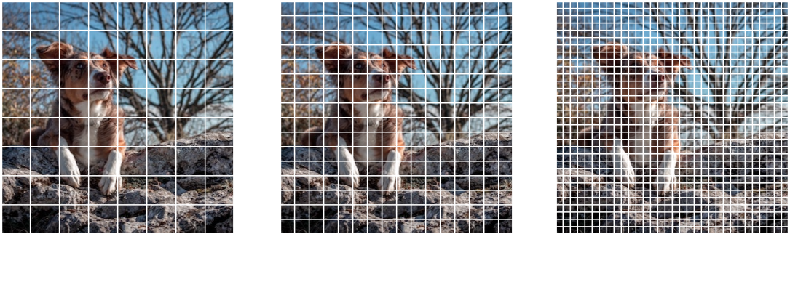
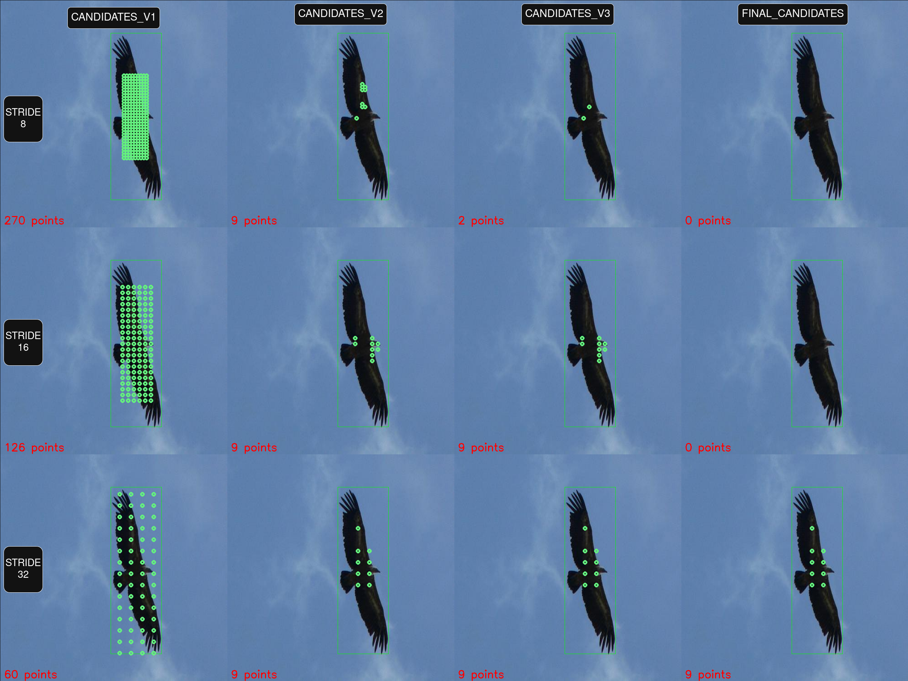

# Lightweight Anchor Dynamic Assignment (LADA) for Object Detection

This repository provides a **training pipeline for [Ultralytics]() object detection models** that replaces the standard label/anchor assignment with the **Lightweight Anchor Dynamic Assignment ([LADA]())** algorithm.

LADA is a lightweight, dynamic matching strategy for selecting positive samples during training.  
It reduces label noise, improves stability in crowded scenes, and works as **anchor-free detection head**.

---

## Key Features

- **Dynamic positive/negative selection** to reduce label noise.
- Improved **training stability in crowded and multi-object scenes**.
- Simple to use Integrated into **Ultralytics Object Detection Models**.

To more [LADA Paper](<ADD_PAPER_LINK>)

---

## Background: Anchor Assignment

**Anchors** (or more generally, candidate boxes/points) are a way to propose multiple potential object locations per image region.  
This concept originated from **Region Proposal Networks** (RPN) in [Faster R-CNN](<ADD_LINK>), and later adapted to one-stage detectors like [SSD](<ADD_LINK>).

Modern YOLO models:
- Historically used **anchor-based heads**.
- Newer variants are often **anchor-free** (predicting distances from grid points, not fixed anchor boxes).

LADA operates **at the assignment stage**, deciding which candidates become **positives** for each ground truth (GT) box during training.

---

## YOLO Model Architecture (Ultralytics-style)

In Ultralytics models, the typical architecture is:

    Backbone → Head (FPN included) → Detect


### 1. Backbone
**Goal:** Extract multi-scale semantic features from the image.

Example outputs for strides {8, 16, 32}:
- P3: `[B, C3, H/8, W/8]`
- P4: `[B, C4, H/16, W/16]`
- P5: `[B, C5, H/32, W/32]`

---

### 2. Head (Includes FPN/PAN)
**Goal:** Process backbone features to predict bounding box offsets and class probabilities.

Example outputs:
- f3: `[B, 4*regmax + nc, H/8, W/8]`
- f4: `[B, 4*regmax + nc, H/16, W/16]`
- f5: `[B, 4*regmax + nc, H/32, W/32]`

---

### 3. Detect
**Goal:** Convert regression distributions to usable bounding boxes.

With **Distributed Focal Loss (DFL)**, each box side (L, T, R, B) is predicted as a discrete probability distribution over `regmax` bins.

- **Input:** f3, f4, f5 (from Head)
- **Output:** `[B, 4 + nc, Total_points]` in **XYXY pixel format**

---

## LADA Algorithm Overview

During training, we must assign **positive** and **negative** points to compute loss.



The image above shows anchor points (squares centers) for all strides (32, 16, 8, (imgsz=640)). **Positive** points are anchors which include any part of dog. But all the positive points might not include meaningful features for dog (might be tree).


LADA improves this assignment process using a multi-stage selection strategy:


*LADA selection flow from initial candidates to final positives.[LADAModel.train(debug=true]*

---

### **Step 1: Candidates_v1 (EPCP - Equally Proportional Center Prior)**

For each GT box `(cx, cy, w, h)` and stride `s`:
```
    r(s) = s / max_stride
    EPCP(s, GTBox) = GTBox_width_height * r(s)
```

- Select all grid points inside EPCP as **initial candidates**.

---

### **Step 2: Candidates_v2 (CLA - Combined Loss of Anchor)**

For each candidate:
- Decode predictions to box & class score.
- Compute **CLA**:
```
    Deviation = |l−r|/(l+r) + |t−b|/(t+b)
    DeviationLoss = 0 if 0 ≤ dev ≤ 1 else dev − 1
    CLA = ClassLoss + GIoULoss + DeviationLoss
```


- Keep **top 9** candidates per stride.

---

### **Step 3: Candidates_v3**
- From all Candidates_v2, keep **top 20** overall.

---

### **Step 4: Final_Candidates**
- Compute average CLA of Candidates_v3.
- Keep only candidates **above average score**.

---

## Installation

```bash
git clone <repo_url>
cd LADA
pip install -r requirements.txt
```

## Usage

```python
from LADAModel import LADAModel
from ultralytics import YOLO, RTDETR

yolo11n = YOLO("yolov11n.pt")
rtdetr_l = RTDETR("rtdetr_l.pt")

models = [yolo11n] # You can fuse models like => models = [yolo11n, rtdetr_l]

model = LADAModel(
    models=models,
    nc=20, # VOC2012 includes 20 classes
    imgsz=640,
    device="cuda"
    )

model.train(data_yaml="/home/neuron/Downloads/VOC2012/data.yaml", epoch=100, batch=24, debug=True) # debug parameter, used to visualize LADA assignment.
```


